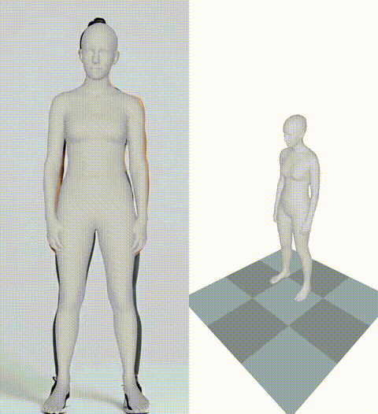
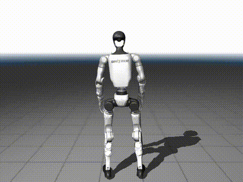
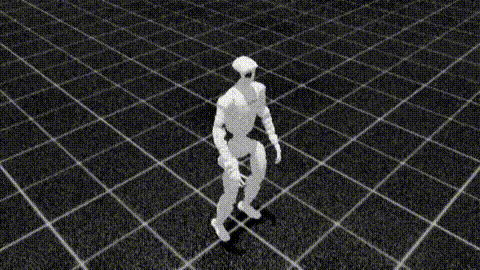

# Robot Motion Reproduction · G1 Motion Pipeline

[中文](#中文) · [English](#english) · [Español](#español)

An auditable workflow that turns monocular human-motion video into validated Unitree G1 reference motion for Whole-Body Tracking (WBT). It packages reproducible source code, documented inputs and outputs, deployment references, and visual evidence in one repository.

> Safety boundary: this repository prepares and validates offline motion assets. It does not send commands to a physical robot; any training or deployment remains a separate, human-approved step.

| GVHMR world reconstruction | GMR G1 retargeting | WBT policy tracking |
|---|---|---|
| [](g1-motion-pipeline/assets/demo/gvhmr_world.mp4) | [](g1-motion-pipeline/assets/demo/gmr_g1.mp4) | [](g1-motion-pipeline/assets/demo/wbt_tracking.mp4) |

## 中文

### 项目简介

本项目将单目人体动作视频转换为经过验证的 Unitree G1 全身跟踪参考动作。流程整合 GVHMR、GMR 或 ProtoMotions / PyRoki 与 WBT，并记录每一个阶段的命令、产物、验证结果和可视化证据。

```text
输入视频 → GVHMR 人体世界坐标运动 → GMR / ProtoMotions 重定向 → G1 参考动作 → WBT 验证
```

### 仓库内容

- `g1-motion-pipeline/`：可审计、人工审核在环的编排流程与项目文档。
- `programs/deploy_real/`：部署参考程序及其已记录的策略/动作输入。
- `programs/playback_scripts/`：本地回放、可视化和坐标验证脚本。
- `reproduction_assets/input/`：GVHMR SMPL CSV 输入与关联视频 CSV。
- `reproduction_assets/output/`：生成的 G1 NPZ 输出与 smoke-test 输出。
- `source/`：选定的本地源码修改、实验说明及复现记录。

### 可复现性与边界

G1 NPZ 在进入训练队列前会检查帧率、关节与刚体维度、数值有限性、四元数和时间连续性。训练默认只生成计划，必须经过人工明确批准才会执行。请在发布或再分发前核对上游项目、模型和数据资产的许可证。

## English

### Overview

This project converts monocular human-motion video into validated Unitree G1 reference motion for Whole-Body Tracking. It integrates GVHMR, GMR or ProtoMotions / PyRoki, and WBT while preserving commands, artifacts, validation reports, and visual evidence for every stage.

```text
Input video → GVHMR world-space motion → GMR / ProtoMotions retargeting → G1 reference motion → WBT validation
```

### Repository layout

- `g1-motion-pipeline/` — auditable orchestration with a human approval gate.
- `programs/deploy_real/` — deployment reference program and documented policy/motion inputs.
- `programs/playback_scripts/` — local playback, visualization, and coordinate-validation helpers.
- `reproduction_assets/input/` — GVHMR SMPL CSV inputs and the associated video CSV.
- `reproduction_assets/output/` — generated G1 NPZ assets and a smoke-test output.
- `source/` — selected local source changes, experiment notes, and reproduction records.

### Validation and scope

Before motion can be queued for training, the workflow checks frame rate, joint and rigid-body dimensions, finite values, quaternion validity, and temporal consistency. Training is planned by default and requires explicit human approval. Review upstream licenses before publishing or redistributing any model or asset.

## Español

### Descripción general

Este proyecto convierte vídeo monocular de movimiento humano en movimiento de referencia validado para Unitree G1 y Whole-Body Tracking (WBT). Integra GVHMR, GMR o ProtoMotions / PyRoki y WBT, conservando comandos, artefactos, informes de validación y evidencia visual de cada etapa.

```text
Vídeo de entrada → movimiento mundial con GVHMR → retargeting GMR / ProtoMotions → movimiento de referencia G1 → validación WBT
```

### Estructura del repositorio

- `g1-motion-pipeline/`: orquestación auditable con aprobación humana.
- `programs/deploy_real/`: programa de referencia para despliegue e inputs documentados de política/movimiento.
- `programs/playback_scripts/`: herramientas locales de reproducción, visualización y validación de coordenadas.
- `reproduction_assets/input/`: entradas SMPL CSV de GVHMR y el CSV de vídeo asociado.
- `reproduction_assets/output/`: activos G1 NPZ generados y una salida de prueba rápida.
- `source/`: cambios locales seleccionados, notas experimentales y registros de reproducción.

### Validación y seguridad

Antes de planificar el entrenamiento, el flujo verifica la frecuencia de cuadros, dimensiones de articulaciones y cuerpos rígidos, valores finitos, cuaterniones y consistencia temporal. El entrenamiento requiere aprobación humana explícita. Revisa las licencias de proyectos, modelos y activos antes de publicarlos o redistribuirlos.

## Further documentation

- [G1 Motion Pipeline](g1-motion-pipeline/)
- [Manual reproduction guide](g1-motion-pipeline/docs/manual-reproduction.md)
- [Archive scope](ARCHIVE_SCOPE.md)
