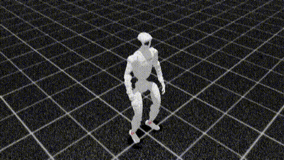
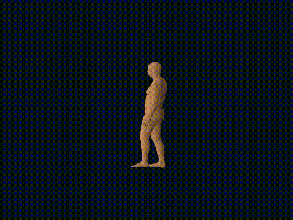
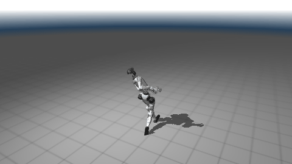
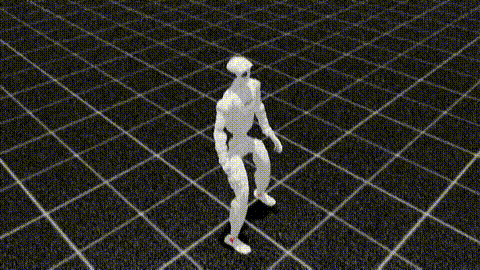
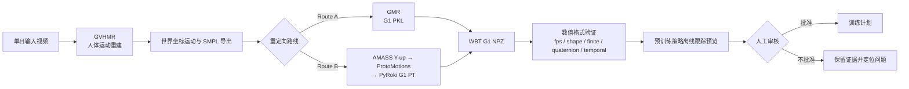
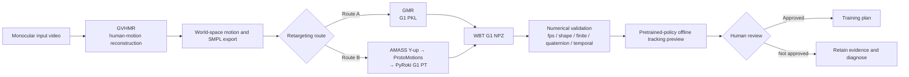

# Robot Motion Reproduction · G1 Motion Pipeline

[中文](#中文) · [English](#english)

> An auditable video-to-Unitree-G1 motion workflow: reconstruct human motion, retarget it to G1, validate the Whole-Body Tracking (WBT) asset, and retain evidence for every representation boundary.

> 项目安全边界：本仓库用于离线动作资产的生成、回放与验证；不向实体机器人发送控制指令。训练或真实部署必须经过独立的人工审核与现场安全确认。

### March video · GMR route

| GVHMR world-space reconstruction | Native GMR G1 replay | Post-training WBT evaluation |
|---|---|---|
|  |  |  |

### Taichi1 · GMR route

| GVHMR-derived SMPL world-motion preview | GMR-retargeted G1 reference preview | Post-training WBT evaluation |
|---|---|---|
|  |  |  |

---

## 中文

### 整体介绍

这是一个面向 Unitree G1 全身跟踪（WBT）的可审计动作复现工作流。项目从单目人体动作视频开始，通过 GVHMR 重建世界坐标系中的人体运动；随后选择 GMR 或 ProtoMotions / PyRoki 路线完成 G1 重定向；最后生成并验证 WBT 所需的 NPZ 参考动作。首页按 March 与 Taichi1 分为两行，分别展示从人体动作、G1 重定向到训练后跟踪的完整证据链。Taichi1 第一格由其保存的 GVHMR SMPL CSV 离线合成，原始 GVHMR 相机/世界重建视频未保留。

与只输出一个动作文件的流程不同，本项目将命令、阶段产物、数值验证报告和可视化证据放在同一个可追溯运行目录中。每一个表示转换边界都可被单独检查：坐标系、采样率、关节布局、四元数以及时序连续性。

### 总流程图

### 阶段、产物与验证

| 阶段 | 主要产物 | 检查重点 |
|---|---|---|
| GVHMR | 世界坐标人体运动、SMPL 导出、相机/世界视角视频 | 人体重建、坐标约定、输入输出对应关系 |
| GMR 或 ProtoMotions / PyRoki | G1 参考运动（PKL 或 PT）与回放证据 | 根朝向、关节范围、接触与动作合理性 |
| WBT 转换 | G1 NPZ | 帧率、关节与刚体维度、有限值、四元数、时间连续性 |
| 训练后评估 | March 视频经 GMR 路线训练后的 WBT 评估录制与报告 | 展示训练后策略对该 GMR 参考动作的跟踪；它补充而不替代数值验证 |

Route B 明确保留 **Y-up** 坐标转换：`GVHMR PT → Y-up AMASS NPZ → MotionLib → PyRoki G1 PT`。跳过或混用该坐标约定，可能得到“文件可生成但视觉无效”的机器人动作。

### 工程贡献简述

除离线动作管线外，我实现了一个将 WBT 机器人参考动作接入 **160 维真实机器人策略观测** 的适配层。它复用 177D SMPL 部署实现中的 ROS/DDS 运行时结构、里程计处理和诊断框架，同时采用 154D 机器人参考方案中的 58D 参考动作语义；二者的命令发布、增益、动作缩放、关节映射和启动行为保持分离。

160D 观测由以下部分组成：58D 参考关节位置/速度、相对躯干位置与朝向、基座线速度/角速度、29D 实测关节位置、29D 实测关节速度以及 29D 上一策略动作。适配层还包含 NPZ 加载、维度一致性检查、参考与实测关节诊断、ONNX 输出检查、循环延迟诊断和显式 dry-run 路径。

该适配层是研究参考而非可直接运行的公开部署工具；仓库不包含凭据、网络配置或公司特定运行时资产。详见 [160D 部署适配说明](g1-motion-pipeline/docs/real-robot-deployment-adapter.md)。

### 仓库结构与复现材料

- `g1-motion-pipeline/`：可审计编排流程、Web 控制台和完整项目文档。
- `programs/deploy_real/`：部署参考程序以及文档中对应的策略/动作输入。
- `programs/playback_scripts/`：本地回放、可视化和坐标验证工具。
- `reproduction_assets/input/`：GVHMR SMPL CSV 输入和关联视频 CSV。
- `reproduction_assets/output/`：生成的 G1 NPZ 输出和 smoke-test 输出。
- `source/`：选定的本地代码改动、实验说明和复现记录。

---

## English

### Overview

This is an auditable motion-reproduction workflow for Unitree G1 Whole-Body Tracking (WBT). Starting from monocular human-motion video, it uses GVHMR to reconstruct world-space human motion, retargets that motion to G1 through either GMR or ProtoMotions / PyRoki, and produces a validated WBT NPZ reference asset. The top section is arranged as parallel March and Taichi1 evidence chains: human motion, G1 retargeting, and post-training tracking. The first Taichi1 panel is an offline world-motion preview synthesized from its preserved GVHMR SMPL CSV; the original GVHMR camera/world reconstruction videos were not retained.

Rather than emitting a single opaque motion file, the workflow keeps commands, stage artifacts, numerical validation reports, and visual evidence together in a traceable run directory. Each representation boundary can be inspected independently: coordinate convention, sampling rate, joint layout, quaternion validity, and temporal consistency.

### End-to-end flow

### Stages, artifacts, and validation

| Stage | Primary artifacts | What is checked |
|---|---|---|
| GVHMR | World-space human motion, SMPL export, camera/world videos | Reconstruction quality, coordinate convention, input-output correspondence |
| GMR or ProtoMotions / PyRoki | G1 reference motion (PKL or PT) and replay evidence | Root orientation, joint limits, contact behavior, visual plausibility |
| WBT conversion | G1 NPZ | Frame rate, joint and rigid-body dimensions, finite values, quaternions, temporal consistency |
| Post-training evaluation | WBT evaluation recording and report after training on the March-video GMR route | Shows trained-policy tracking of the GMR reference motion; this complements rather than replaces numerical validation |

Route B intentionally preserves the **Y-up** coordinate contract: `GVHMR PT → Y-up AMASS NPZ → MotionLib → PyRoki G1 PT`. Skipping or mixing this convention can create a file that exists but is visually invalid as robot motion.

### Engineering contribution

In addition to the offline motion pipeline, I implemented an adapter that connects WBT robot-reference motion to a **160-dimensional real-robot policy observation**. It retains the ROS/DDS runtime structure, odometry handling, and diagnostic pattern from a 177D SMPL deployment reference, while using the 58D robot-reference semantics of a 154D reference. Command publication, gains, action scaling, joint mapping, and startup behavior remain deliberately separate.

The 160D observation contains 58D reference joint position/velocity, relative torso position and orientation, base linear/angular velocity, 29D measured joint position, 29D measured joint velocity, and 29D previous policy action. The adapter adds NPZ loading, dimensional checks, reference-versus-measured joint diagnostics, ONNX-output inspection, loop-latency diagnostics, and an explicit dry-run path.

This adapter is a research reference, not a ready-to-run public deployment. The repository omits credentials, network configuration, and company-specific runtime assets. See the [160D deployment adapter note](g1-motion-pipeline/docs/real-robot-deployment-adapter.md).

### Repository layout and reproduction materials

- `g1-motion-pipeline/` — auditable orchestration, web console, and project documentation.
- `programs/deploy_real/` — deployment reference code and documented policy/motion inputs.
- `programs/playback_scripts/` — local playback, visualization, and coordinate-validation helpers.
- `reproduction_assets/input/` — GVHMR SMPL CSV inputs and the associated video CSV.
- `reproduction_assets/output/` — generated G1 NPZ assets and a smoke-test output.
- `source/` — selected local source changes, experiment notes, and reproduction records.

## Documentation

- [G1 Motion Pipeline](g1-motion-pipeline/)
- [Manual reproduction guide](g1-motion-pipeline/docs/manual-reproduction.md)
- [160D deployment adapter](g1-motion-pipeline/docs/real-robot-deployment-adapter.md)
- [Archive scope](ARCHIVE_SCOPE.md)
