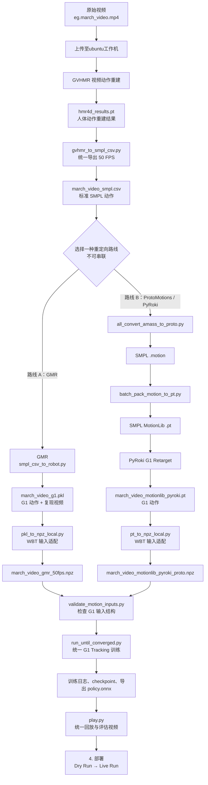

# G1 动作处理总线路

## 目录

- [[#文档入口]]
- [[#阶段边界]]

这是一个面向 G1 人形机器人的动作复现与全身追踪项目。项目以普通视频为输入，依次完成三维人体动作重建、动作重定向、全身追踪训练、策略评估与机器人部署，使视频中的人体动作能够在 G1 上稳定复现。

本文档以 `march_video`（原地踏步动作）为例，完整说明从视频输入到 G1 执行原地踏步动作的操作流程。

总体流程图如下：

## 文档入口

1. [[1. GVHMR]]：视频上传、GVHMR 重建，以及 PT 转 50 FPS SMPL CSV。
2. [[2. 重定向]]：选择 GMR 或 ProtoMotions / PyRoki，将 SMPL 动作映射为 G1 动作。
3. [[3. Whole-Body Tracking]]：将 G1 PKL/PT 适配为 WBT NPZ；之后统一校验、训练和评估。
4. [[4.  部署]]：基于已验证策略完成 Dry Run，再执行 Live Run。
5. [[G1 人形机器人动作复现]]：拆分前原始文档备份，用于核对细节。

> [!warning]
> 只能二选一：GMR 的 PKL/NPZ、训练运行目录和 checkpoint，不能与 ProtoMotions / PyRoki 路线的 PT/NPZ、运行目录或 checkpoint 混用。

## 阶段边界

| 阶段       | 结束产物                          | 说明                                   |
| -------- | ----------------------------- | ------------------------------------ |
| GVHMR    | `march_video_smpl.csv`        | 两条路线共用的 50 FPS SMPL 输入。              |
| 重定向      | GMR `*.pkl` 或 PyRoki `*.pt`   | 到这里为止仍是路线特有的 G1 动作生成。                |
| WBT 输入适配 | `*.npz`                       | 把路线特有格式转换为 Whole-Body Tracking 可读格式。 |
| WBT 通用阶段 | checkpoint、评估视频、`policy.onnx` | 两条路线使用同一训练和回放工具，仅替换动作文件与运行目录。        |

