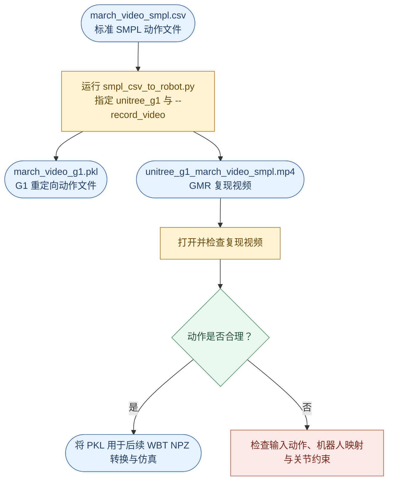
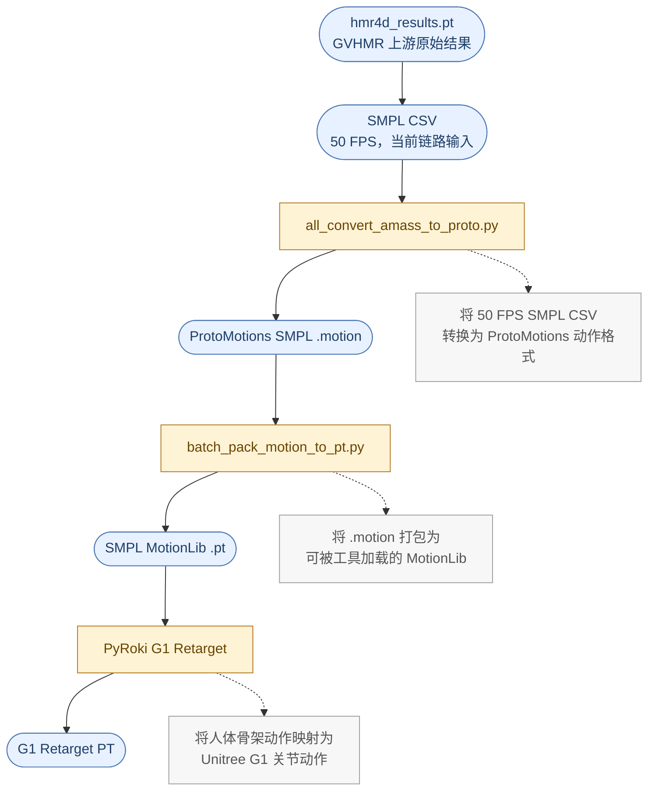

[[0. G1 人形机器人动作复现总线路]] ｜ [[1. GVHMR]] ｜ [[3. Whole-Body Tracking]]
## 目录

- [[#2.1 GMR Retargeting]]
- [[#2.2 ProtoMotions / PyRoki Retargeting]]


本页以 `march_video`（原地踏步）为例，记录将 SMPL 人体动作重定向为 G1 动作的独立操作内容。

## 2.1 GMR Retargeting

本路线使用 **GMR** 将 GVHMR 重建得到的人体 SMPL 动作转换为 Unitree G1 机器人的关节动作。

路线流程如下：



图例：蓝色圆角节点为输入或输出文件，黄色矩形为处理步骤，灰色节点为步骤说明。

### 2.1.1 使用 GMR 生成 G1 动作文件并录制复现视频 [[GMR-(2)-由 GMR 生成 G1 Pickle + Reproduction Log]]

本步骤使用 GMR 将标准 SMPL CSV 动作重定向到 Unitree G1 机器人。

输入文件：

```
/home/unitree/projects/GVHMR/outputs/march_video/march_video_smpl.csv
```

输出文件：

```
/home/unitree/projects/GMR/motions/G1/march_video_g1.pkl
```

执行以下命令：

```
cd /home/unitree/projects/GMR

conda run -n gmr python scripts/smpl_csv_to_robot.py \
  --input /home/unitree/projects/GVHMR/outputs/march_video/march_video_smpl.csv \
  --robot unitree_g1 \
  --output motions/G1/march_video_g1.pkl \
  --record_video
```

参数说明：

- `--input`：指定由 GVHMR PT 转换而来的标准 SMPL CSV 动作文件。
- `--robot unitree_g1`：指定目标机器人模型为 Unitree G1。
- `--output`：指定 G1 重定向动作 PKL 文件的保存位置。
- `--record_video`：在执行重定向的同时录制机器人动作复现视频。

运行期间，GMR 会将人体 SMPL 骨架与动作序列映射到 G1 的关节结构和运动约束下，并生成对应的机器人动作数据。

### 2.1.2 检查 GMR 输出

处理完成后，应生成以下文件：

```
/home/unitree/projects/GMR/motions/G1/march_video_g1.pkl
/home/unitree/projects/GMR/videos/unitree_g1_march_video_smpl.mp4
```

其中：

- `march_video_g1.pkl`：GMR 生成的 Unitree G1 机器人动作文件，可作为后续转换为 WBT 动作文件的输入。
- `unitree_g1_march_video_smpl.mp4`：GMR 录制的 G1 动作复现视频，用于检查重定向效果。

可以使用以下命令打开复现视频：

```
xdg-open /home/unitree/projects/GMR/videos/unitree_g1_march_video_smpl.mp4
```

打开后，重点检查 G1 是否能够合理复现原视频中的原地踏步动作，包括：

- 双腿是否交替抬起和落地；
- 左右脚动作是否正确对应；
- 手臂摆动是否自然；
- 躯干是否出现明显倾斜、扭转或抖动；
- 动作是否出现关节反向、异常拉伸或不连续跳变。

确认 GMR 复现视频中的 G1 动作合理后，即可将 `march_video_g1.pkl` 作为后续 **WBT NPZ 转换与 WBT 仿真** 的输入。


## 2.2 ProtoMotions / PyRoki Retargeting

本节使用 GVHMR 已生成的人体运动结果，将当前视频对应的 SMPL 动作转换为 ProtoMotions MotionLib，并通过 PyRoki 重定向为 Unitree G1 机器人动作。

本路线的完整数据链路如下：



图例：蓝色圆角节点为数据或中间产物，黄色矩形为处理步骤。

### 2.2.1 准备当前链路的 SMPL CSV 输入

#### 2.2.1.1 进入 ProtoMotions 环境

首先进入 ProtoMotions 项目目录，并激活环境：

```
cd /home/unitree/projects/ProtoMotions
conda activate protomotions
```

创建本次视频所需的目录。以下示例使用 `march_video` 作为视频名称；如果处理其他视频，请将各处目录名统一替换为对应名称。

```
mkdir -p input/march_video/amass \
  input/march_video/motionlib \
  input/march_video/pyroki_50fps
```

上述目录的用途如下：

- `input/march_video/amass`：保存从 GVHMR 导出的 AMASS NPZ 与 ProtoMotions `.motion` 文件。
    
- `input/march_video/motionlib`：保存 ProtoMotions 使用的 MotionLib 文件。
    
- `input/march_video/pyroki_50fps`：保存 PyRoki 输出的 G1 重定向动作。
    

#### 2.2.1.2 当前输入：50 FPS SMPL CSV → ProtoMotions `.motion`

当前 ProtoMotions 链路的输入是第 1.4 节导出的、与当前视频对应的 **50 FPS SMPL CSV**。将该 CSV 直接传给 `all_convert_amass_to_proto.py`，由它生成 SMPL `.motion`；当前链路不以 AMASS NPZ 作为实际输入。

`all_convert_amass_to_proto.py` 同时兼容两种输入：

- AMASS `.npz`：沿用原有的 AMASS 读取逻辑；
- SMPL CSV：识别 `smpl_params_global_transl_*`、`smpl_params_global_global_orient_*` 和 `smpl_params_global_body_pose_*` 列后直接转换。

在 ProtoMotions 环境中执行当前 CSV 输入分支：

```
cd /home/unitree/projects/ProtoMotions
conda activate protomotions

PYTHONPATH="$PWD" python data/scripts/all_convert_amass_to_proto.py \
  --input-root-dir /home/unitree/projects/GVHMR/outputs/march_video/march_video_smpl.csv \
  --output-root-dir /home/unitree/projects/ProtoMotions/input/march_video/amass \
  --humanoid-type smpl \
  --csv-fps 50 \
  --output-fps 50 \
  --force-remake
```

其中 `--input-root-dir` 直接接收单个 CSV 文件；单文件输入时，`.motion` 会直接写入 `--output-root-dir`。`--csv-fps 50` 仅在 CSV 缺少 `fps`、`mocap_framerate` 或 `mocap_frame_rate` 列时作为输入帧率；`--output-fps 50` 保持生成的 ProtoMotions 动作也是 50 FPS，不进行帧率转换。`--force-remake` 确保输出来自本次 CSV，而非已有同名 `.motion`。运行前应确认 CSV 表头包含脚本所需的 `smpl_params_global_*` 列。

因此，当前视频无需为了这条链路额外导出或复制 `march_video.npz`。只有在需要接入仅接受 AMASS 的旧工具或其他兼容流程时，才使用 AMASS NPZ 输入分支。

预期 `.motion` 输出文件为：

```
/home/unitree/projects/ProtoMotions/input/march_video/amass/march_video_smpl.motion
```

转换完成后检查：

```
test -f input/march_video/amass/march_video_smpl.motion
```

**没有任何输出，且命令正常返回**：文件存在，检查通过。

#### 2.2.1.3 可选兼容分支：GVHMR PT → AMASS NPZ （可跳过）

仅当需要向只接受 AMASS 文件的工具提供输入时，才执行以下命令，将 GVHMR 生成的 `hmr4d_results.pt` 转换为 AMASS 格式：

```
python data/scripts/gvhmr_to_amass_npz.py \
  /home/unitree/projects/GVHMR/outputs/march_video/hmr4d_results.pt \
  input/march_video/amass/march_video.npz \
  --fps 30
```

参数说明：

- 第一个路径：当前视频的 GVHMR 输出 `hmr4d_results.pt`。
    
- 第二个路径：导出的 AMASS NPZ 保存位置。
    
- `--fps 30`：以 30 FPS 导出，与当前 GVHMR 视频结果保持一致。
    

转换完成后，检查文件是否成功生成：

```
test -f input/march_video/amass/march_video.npz
```

若命令没有输出内容，表示检查通过。

### 2.2.2 可选 AMASS 输入分支：将 AMASS 动作转为 ProtoMotions `.motion` （可跳过）

本节仅适用于输入为 AMASS NPZ 的兼容分支。当前链路使用 SMPL CSV，应改用 `all_convert_amass_to_proto.py`，而不是把 CSV 先落盘为 AMASS NPZ 再调用本节命令。AMASS NPZ 保持 GVHMR 使用的 Y-up 坐标系；ProtoMotions 的动作转换需要通过 `--source-y-up` 明确完成坐标系处理。

在 ProtoMotions 项目根目录运行：

```
cd /home/unitree/projects/ProtoMotions

PYTHONPATH="$PWD" python data/scripts/convert_amass_to_proto.py \
  input/march_video/amass \
  --humanoid-type smpl \
  --output-fps 50 \
  --source-y-up \
  --force-remake
```

参数说明：

- `input/march_video/amass`：包含 `march_video.npz` 的目录。
    
- `--humanoid-type smpl`：指定输入动作为 SMPL 人体模型。
    
- `--output-fps 50`：将动作统一转换为 50 FPS，匹配后续 PyRoki 与 G1 Tracking 流程。
    
- `--source-y-up`：声明源动作使用 Y-up 坐标系，并转换到 ProtoMotions 所需坐标系。
    
- `--force-remake`：即使已有同名 `.motion`，也重新生成，确保输出与当前 NPZ 对应。
    

转换完成后，检查 `.motion` 文件：

```
test -f input/march_video/amass/march_video.motion
ls -lh input/march_video/amass/march_video.motion
```

预期文件路径：

```
/home/unitree/projects/ProtoMotions/input/march_video/amass/march_video.motion
```

### 2.2.3 生成 SMPL MotionLib PT

当前链路直接使用 `batch_pack_motion_to_pt.py` 将第 2.2.1.2 节生成的 SMPL `.motion` 批量打包为 SMPL MotionLib `.pt`，随后由 PyRoki 从输出目录读取。

```
cd /home/unitree/projects/ProtoMotions

PYTHONPATH="$PWD" python protomotions/components/batch_pack_motion_to_pt.py \
  --input-dir input/march_video/amass \
  --output-dir input/march_video/motionlib \
  --device cpu \
  --recursive
```


  已分别生成两个独立的 MotionLib PT：

  - input/march_video/motionlib/march_video.pt
  - input/march_video/motionlib/march_video_smpl.pt


### 2.2.4 在 IsaacLab 运行 SMPL Motion Tracker （仅中途可视化检查，与主链路无关）

此步骤用于在 IsaacLab 中加载 MotionLib，并检查 SMPL 人体动作是否能够被 Motion Tracker 正确读取和跟踪。

进入 ProtoMotions 项目并激活 IsaacLab 环境：

```
cd /home/unitree/projects/ProtoMotions
conda activate isaaclab
```

运行 SMPL Motion Tracker：

```
MOTIONLIB_PT=$(find input/march_video/motionlib -type f -name '*.pt' -print -quit)

python protomotions/inference_agent.py \
  --checkpoint data/pretrained_models/motion_tracker/smpl/last.ckpt \
  --motion-file "$MOTIONLIB_PT" \
  --simulator isaaclab \
  --num-envs 1
```

参数说明：

- `--checkpoint`：ProtoMotions 提供的预训练 SMPL Motion Tracker 模型。
    
- `--motion-file`：第 2.2.3 节生成的 MotionLib。
    
- `--simulator isaaclab`：使用 IsaacLab 作为仿真后端。
    
- `--num-envs 1`：只启动一个环境，便于观察当前视频动作。
    

运行后重点检查：

- 程序是否能正常加载第 2.2.3 节批处理生成的 MotionLib PT；
    
- SMPL 人体是否能连续播放动作；
    
- 原地踏步的左右腿交替、躯干姿态和动作节奏是否合理；
    
- 是否存在人物倒地、动作轴向错误、漂移严重或抖动异常等问题。
    

如果该步骤出现明显方向错误，应优先确认第 2.2.2 节是否使用了 `--source-y-up`，以及第 2.2.1 节输入是否确实来自当前视频的 `hmr4d_results.pt`。

### 2.2.5 使用 PyRoki 生成为 G1 Retarget 动作

本步骤将 MotionLib 中的 SMPL 动作重定向到 Unitree G1 机器人。

> [!note]  
> PyRoki 的输入是第 2.2.3 节生成 MotionLib PT 的整个目录 `input/march_video/motionlib`，不是 GVHMR 的 PT，也不是 AMASS NPZ。

进入 ProtoMotions 项目并激活环境：

```
cd /home/unitree/projects/ProtoMotions
conda activate protomotions
```

执行 G1 重定向脚本：

```
./scripts/retarget_amass_to_robot.sh \
  /home/unitree/miniconda3/envs/protomotions/bin/python \
  /home/unitree/miniconda3/envs/pyroki/bin/python \
  /home/unitree/projects/ProtoMotions/input/march_video/motionlib \
  /home/unitree/projects/ProtoMotions/input/march_video/pyroki_50fps \
  g1
```

参数说明：

- 第一个 Python 路径：ProtoMotions 环境的 Python。
    
- 第二个 Python 路径：PyRoki 环境的 Python。
    
- 第三个路径：MotionLib 输入目录。
    
- 第四个路径：PyRoki 输出目录。
    
- `g1`：目标机器人类型为 Unitree G1。

完成后检查输出目录：

```
ls -lh /home/unitree/projects/ProtoMotions/input/march_video/pyroki_50fps/
```

预期得到：

```
/home/unitree/projects/ProtoMotions/input/march_video/pyroki_50fps/march_video_motionlib_pyroki.pt
```

至此，ProtoMotions / PyRoki 的动作重定向完成。


### 2.2.6 查看 ProtoMotions / PyRoki 重定向结果

完成 PyRoki 重定向后，使用 ProtoMotions 官方的 Motion Visualizer 播放生成的 G1 MotionLib，确认动作在进入 Whole-Body Tracking 前具有正确的姿态、节奏与方向。

进入 ProtoMotions 项目并激活 IsaacLab 环境：

```bash
cd /home/unitree/projects/ProtoMotions
conda activate isaaclab
```

运行可视化工具：

```bash
python examples/motion_libs_visualizer.py \\
  --motion_files input/march_video/pyroki_50fps/march_video_motionlib_pyroki.pt \\
  --robot g1 \\
  --simulator isaaclab
```

运行后会打开 IsaacLab 可视化窗口，显示重定向后的 G1 动作。以 `march_video` 的原地踏步为例，重点检查左右腿是否交替自然、脚部是否明显滑动或穿透地面、躯干是否稳定，以及动作朝向与节奏是否正确。

若可视化结果异常，应优先检查 PyRoki 输出文件是否来自当前 MotionLib，以及上游 SMPL 动作的坐标系和帧率设置。该步骤仅用于运动学结果验收，不替代后续 Whole-Body Tracking 的训练与策略回放。

