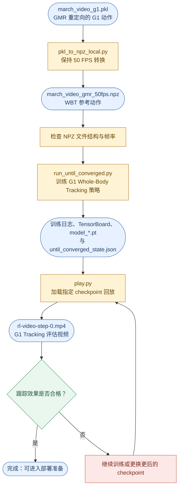
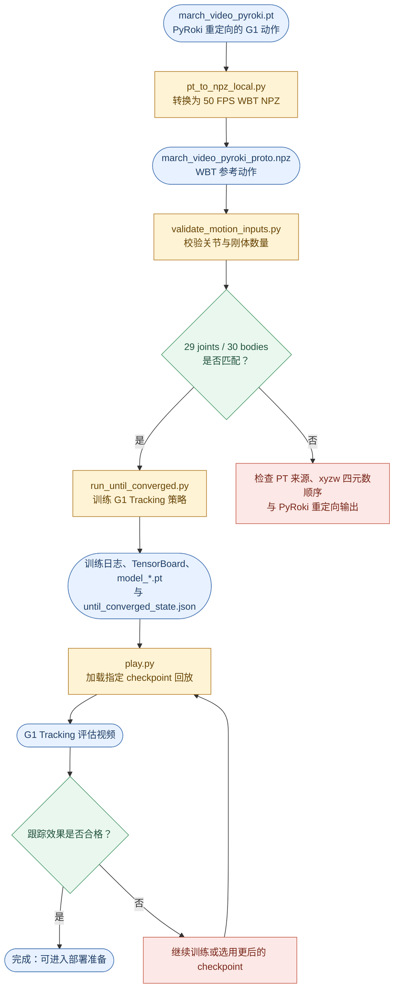

[[0. G1 人形机器人动作复现总线路]] ｜ [[2. 重定向]] ｜ [[4. 部署]]

## 目录

- [[#统一训练命令格式]]
- [[#3.1 GMR 路线：Whole-Body Tracking]]
- [[#3.2 ProtoMotions / PyRoki 路线：Whole-Body Tracking]]


本页以 `march_video`（原地踏步）为例，记录 Whole-Body Tracking 输入适配、训练、评估与导出的独立操作内容。

GMR 与 ProtoMotions / PyRoki 两条重定向路线在此汇合：两者都先转换为 Whole-Body Tracking（WBT）可读取的 NPZ 动作文件，再使用同一套训练脚本与收敛判定流程。为便于按数据链路检查，先记录 ProtoMotions / PyRoki 的 WBT 阶段，随后记录 GMR 的 WBT 阶段。

## 统一训练命令格式

两条路线的训练命令均使用 `scripts/run_until_converged.py`。除 `--motion-file`、`--run-dir` 与 `--run-name` 外，其余参数保持一致：

```text
/home/unitree/miniconda3/envs/whole_body_tracking/bin/python -u \
  scripts/run_until_converged.py \
  --motion-file <WBT_NPZ> \
  --run-dir <RUN_DIR> \
  --run-name <RUN_NAME> \
  --num-envs 4096 \
  --seed 0 \
  --min-iterations 30000 \
  --segment-iterations 10000 \
  --window 1000 \
  --poll-seconds 60
```

本节将 PyRoki 输出的 G1 动作 PT 转换为 Whole-Body Tracking 所需的 NPZ，并开始 G1 Tracking 训练。

完整数据链路如下：

```
march_video_pyroki.pt
    ↓
march_video_pyroki_proto.npz
    ↓
G1 Tracking 训练日志与 checkpoint
    ↓
G1 Tracking 评估视频
```


> [!important]  
> ProtoMotions / PyRoki 路线的 Whole-Body Tracking 只使用该链路经 PyRoki 生成的动作文件；不要混用 GMR 的 PKL、NPZ 或对应训练结果。

## 3.1 GMR 路线：Whole-Body Tracking

本节使用 GMR 路线生成的 `march_video_g1.pkl`，将其转换为 Whole-Body Tracking（WBT）可读取的动作文件，并训练 Unitree G1 的全身动作跟踪策略，最后回放训练结果并生成评估视频。

本路线的目标是让 G1 机器人学习跟踪“原地踏步（march）”动作。



图例：蓝色圆角节点为文件、日志或阶段产物，黄色矩形为执行步骤，绿色菱形为验收判断，红色节点表示需要继续迭代的情况。

### 3.1.1 将 GMR PKL 转换为 WBT NPZ（保持 50 FPS）

GMR 的输入 SMPL CSV 已是 50 FPS，GMR 输出的 `march_video_g1.pkl` 也应保持 50 FPS。Whole-Body Tracking 仍需要将其转换为 NPZ 文件，但无需再执行 30 FPS → 50 FPS 的重采样。

#### 3.1.1.1 输入与输出文件

本步骤的输入文件为：

```
/home/unitree/projects/GMR/motions/G1/march_video_g1.pkl
```

转换后的输出文件为：

```
/home/unitree/projects/whole_body_tracking/inputs/march_video/march_video_gmr_50fps.npz
```

其中：

- `march_video_g1.pkl`：GMR 路线生成的 G1 机器人动作数据。
    
- `march_video_gmr_50fps.npz`：转换后供 Whole-Body Tracking 训练使用的动作文件。
    
- 输入动作帧率为 50 FPS。
    
- 输出动作帧率为 50 FPS。
    

#### 3.1.1.2 执行动作转换

首先进入 Whole-Body Tracking 项目目录：

```
cd /home/unitree/projects/whole_body_tracking
```

随后执行以下命令，将 PKL 文件转换为 NPZ 文件：

```
/home/unitree/miniconda3/envs/whole_body_tracking/bin/python \
  /home/unitree/BysanRL/BeyondMimic/whole_body_tracking/scripts/pkl_to_npz_local.py \
  --input_path /home/unitree/projects/GMR/motions/G1/march_video_g1.pkl \
  --output_path /home/unitree/projects/whole_body_tracking/inputs/march_video/march_video_gmr_50fps.npz \
  --input_fps 50 \
  --output_fps 50 \
  --input_root_rot_order xyzw \
  --headless \
  --device cuda:0
```

参数说明：

- `--input_path`：指定 GMR 生成的 PKL 动作文件路径。
    
- `--output_path`：指定转换后的 WBT 动作文件保存路径。
    
- `--input_fps 50`：指定输入动作数据的原始帧率为 50 FPS。
    
- `--output_fps 50`：保持 50 FPS 输出，以适配 WBT 训练；不会发生帧率重采样。
    
- `--input_root_rot_order xyzw`：指定输入根节点四元数的分量顺序。
    
- `--headless`：无界面运行，不打开可视化窗口。
    
- `--device cuda:0`：使用第 0 块 GPU 执行转换。
    

#### 3.1.1.3 检查转换结果

转换完成后，使用以下命令确认输出文件是否已成功生成：

```
ls -lh /home/unitree/projects/whole_body_tracking/inputs/march_video/march_video_gmr_50fps.npz
```

若命令能够显示文件大小、修改时间等信息，说明转换成功。

后续训练将使用该文件：

```
/home/unitree/projects/whole_body_tracking/inputs/march_video/march_video_gmr_50fps.npz
```

---

### 3.1.2 开始 G1 Whole-Body Tracking 训练

完成动作转换后，即可使用生成的 NPZ 文件训练 G1 Tracking 策略。

训练的目标是让强化学习策略根据参考动作轨迹，控制 G1 机器人尽可能准确地完成对应的原地踏步动作。

#### 3.1.2.1 启动训练

进入 Whole-Body Tracking 项目目录：

```
cd /home/unitree/projects/whole_body_tracking
```

执行以下训练命令：

```
/home/unitree/miniconda3/envs/whole_body_tracking/bin/python -u \
  scripts/run_until_converged.py \
  --motion-file /home/unitree/projects/whole_body_tracking/inputs/march_video/march_video_gmr_50fps.npz \
  --run-dir /home/unitree/projects/whole_body_tracking/logs/rsl_rl/g1_flat/2026-09-09_04-16-52_baseline_march_video_gmr_100k \
  --run-name 2026-09-09_04-16-52_baseline_march_video_gmr_100k \
  --num-envs 4096 \
  --seed 0 \
  --min-iterations 30000 \
  --segment-iterations 10000 \
  --window 1000 \
  --poll-seconds 60
```

参数说明：

- `--motion-file`：指定本次训练使用的 G1 参考动作 `.npz` 文件，训练策略将学习跟踪该动作轨迹。
    
- `--run-dir`：指定本次训练的输出目录和断点续训目录。TensorBoard 日志、`model_*.pt` checkpoint 以及自动收敛状态文件都会保存在该目录中；训练中断后使用相同目录重新运行，可从最新健康 checkpoint 继续训练。
    
- `--run-name march_video_gmr_until_converged`：为本次训练指定名称，便于在训练日志和 TensorBoard 中区分不同实验。
    
- `--num-envs 4096`：并行启动 4096 个 Isaac Lab 仿真环境，以提高训练采样效率。
    
- `--seed 0`：设置随机种子，便于复现实验结果。
    
- `--min-iterations 30000`：设置最少训练轮数为 30,000。达到 30,000 轮后才开始进行收敛判断；该参数不是最大训练轮数限制。
    
- `--segment-iterations 10000`：设置每个自动续训阶段增加 10,000 轮训练。每完成一个阶段后检查收敛状态，如果尚未收敛，则从最新 checkpoint 自动继续训练下一个 10,000 轮。
    
- `--window 1000`：设置收敛检测窗口大小为最近 1,000 轮，用于比较奖励、跟踪误差等训练指标的变化，判断模型是否进入稳定平台期。
    
- `--poll-seconds 60`：设置状态检查间隔为 60 秒。脚本每隔 60 秒读取 TensorBoard 指标，并检查 NaN、Inf、训练状态以及相关收敛条件。

而该命令指定新的输出目录：

```
logs/rsl_rl/g1_flat/march_video_gmr_until_converged/

/home/unitree/projects/whole_body_tracking/logs/rsl_rl/g1_flat/
march_video_gmr_until_converged/
├── model_*.pt                 # checkpoint
├── events.out.tfevents.*      # TensorBoard 曲线
├── params/                    # 环境与 PPO 配置
└── until_converged_state.json # 自动收敛状态与最终 checkpoint
```

### 3.1.3 回放模型并生成评估视频

训练完成或达到阶段性检查点后，可以加载指定 checkpoint 进行回放，并生成 G1 Tracking 的评估视频。

#### 3.1.3.1 运行回放并录制视频

进入项目目录：

```
cd /home/unitree/projects/whole_body_tracking
```

执行以下命令加载训练模型并生成评估视频：

```
/home/unitree/miniconda3/envs/whole_body_tracking/bin/python \
  scripts/rsl_rl/play.py \
  --task Tracking-Flat-G1-v0 \
  --motion_file /home/unitree/projects/whole_body_tracking/inputs/march_video/march_video_gmr_50fps.npz \
  --load_run 2026-09-09_04-16-52_baseline_march_video_gmr_100k \
  --checkpoint model_30500.pt \
  --video \
  --headless
```

参数说明：

- `--task Tracking-Flat-G1-v0`：指定与训练阶段一致的 G1 Tracking 任务。
    
- `--motion_file`：指定用于跟踪的参考动作文件。
    
- `--load_run`：指定需要加载的训练运行目录名称。
    
- `--checkpoint`：指定需要回放的模型文件。
    
- `--num_envs 1`：只运行一个仿真环境，便于观察单个机器人的跟踪效果。
    
- `--video`：启用视频录制。
    
- `--headless`：无界面运行并在后台生成视频。
    

#### 3.1.3.2 查看评估视频

```
cd /home/unitree/projects/whole_body_tracking/logs/rsl_rl/g1_flat/2026-09-09_04-16-52_baseline_march_video_gmr_100k/evaluation/march_video_gmr_50fps/video

xdg-open rl-video-step-0.mp4
```

查看视频时，重点检查以下内容：

- G1 是否能够稳定保持站立。
    
- 双腿是否能够跟随参考动作完成交替踏步。
    
- 躯干、手臂和头部姿态是否合理。
    
- 足部是否存在明显滑动、悬空或抖动。
    
- 机器人动作是否与参考轨迹在节奏和幅度上基本一致。
    

若跟踪效果仍不稳定，可继续训练，并加载更靠后的 checkpoint 重新生成评估视频进行对比。

---

### 3.1.4 GMR 路线 交付物清单

完成 Whole-Body Tracking 流程后，应保留以下文件与结果。

#### 3.1.4.1 GMR 输出动作文件

```
/home/unitree/projects/GMR/motions/G1/march_video_g1.pkl
```

该文件为 GMR 路线生成的 G1 机器人动作数据，也是 WBT 阶段的输入。

#### 3.1.4.2 WBT 训练动作文件

```
/home/unitree/projects/whole_body_tracking/inputs/march_video/march_video_gmr_50fps.npz
```

该文件为保持 50 FPS 的 G1 动作文件，用于 G1 Tracking 训练与回放。

#### 3.1.4.3 训练日志与模型 Checkpoint

训练结果目录示例：

```
/home/unitree/projects/whole_body_tracking/logs/rsl_rl/g1_flat/<run_name>/
```

应至少保留：

- TensorBoard 日志文件。
    
- 训练配置文件。
    
- 阶段性模型 checkpoint，例如 `model_30000.pt`、`model_37500.pt` 或最终模型文件。
    
- 对应训练运行目录名称。
    

#### 3.1.4.4 G1 Tracking 评估视频

评估视频示例：

```
/home/unitree/projects/whole_body_tracking/logs/rsl_rl/g1_flat/<run_name>/evaluation/march_video_gmr_50fps/video/rl-video-step-0.mp4
```

该视频用于直观验证训练后的 G1 是否能够稳定、准确地跟踪原地踏步动作。


## 3.2 ProtoMotions / PyRoki 路线：Whole-Body Tracking



图例：蓝色圆角节点为文件、日志或阶段产物，黄色矩形为执行步骤，绿色菱形为校验或验收判断，红色节点表示需回查或继续迭代的情况。

### 3.2.1 准备 PyRoki 动作并转换为 WBT NPZ

本路线只使用 9 月 15 日形成的新动作链路。训练输出目录必须是独立的新目录；不要复用或加载 `2026-09-04_10-22-28_march_video_pyroki` 中的 checkpoint、日志或视频。

```
cd /home/unitree/projects/whole_body_tracking

mkdir -p inputs/march_video/proto_50fps
mkdir -p logs/rsl_rl/g1_flat/2026-09-17_march_video_pyroki
```

#### 3.2.1.1 准备目录并执行 PT 转 NPZ（50 FPS）

输入是 PyRoki 输出的 `march_video_pyroki.pt`，输出是 WBT 唯一使用的参考动作 `march_video_pyroki_proto.npz`。`--input_root_rot_order xyzw` 用于保持根节点四元数分量顺序一致，`--output_fps 50` 将 WBT 输入固定为 50 FPS。

```
/home/unitree/miniconda3/envs/whole_body_tracking/bin/python \
  scripts/pt_to_npz_local.py \
  --input_path /home/unitree/projects/ProtoMotions/input/march_video/pyroki_50fps/march_video_pyroki.pt \
  --output_path inputs/march_video/proto_50fps/march_video_pyroki_proto.npz \
  --input_root_rot_order xyzw \
  --output_fps 50 \
  --headless
```

#### 3.2.1.2 验证 WBT NPZ 输入

转换完成后必须先验证，再训练。只有验证结果同时包含 `50 FPS` 与 `29 joints | 30 bodies` 时，才继续下一步；任一项不匹配时，应回到转换步骤检查 PT 来源和旋转顺序，不要开始训练。

```
/home/unitree/miniconda3/envs/whole_body_tracking/bin/python \
  scripts/validate_motion_inputs.py \
  inputs/march_video/proto_50fps/march_video_pyroki_proto.npz
```

确认输出为：`50 FPS`、`29 joints | 30 bodies`。

### 3.2.2 启动全新的 G1 Tracking 训练

此命令从新 NPZ 训练新的 Tracking 策略。`--run-dir` 与 `--run-name` 都固定为 `2026-09-17_march_video_pyroki`，确保日志、checkpoint 和后续评估视频不会与旧实验混在一起。

```
/home/unitree/miniconda3/envs/whole_body_tracking/bin/python -u \
  scripts/run_until_converged.py \
  --motion-file /home/unitree/projects/whole_body_tracking/inputs/march_video/proto_50fps/march_video_pyroki_proto.npz \
  --run-dir /home/unitree/projects/whole_body_tracking/logs/rsl_rl/g1_flat/2026-09-17_march_video_pyroki \
  --run-name 2026-09-17_march_video_pyroki \
  --num-envs 4096 \
  --seed 0 \
  --min-iterations 30000 \
  --segment-iterations 10000 \
  --window 1000 \
  --poll-seconds 60
```

#### 3.2.2.1 训练日志与运行标识

训练过程中生成的 TensorBoard 事件、`model_*.pt` checkpoint、参数配置和 `until_converged_state.json` 都位于本次 run 目录。后续回放时，`--load_run` 必须使用此 run 名称。

```
--motion_file inputs/march_video/proto_50fps/march_video_pyroki_proto.npz
--load_run 2026-09-17_march_video_pyroki
```


#### 3.2.2.2 查看训练日志

建议在训练开始后和每个 10,000 iteration 阶段结束后查看一次曲线，用于决定是否已经稳定收敛以及应选用哪个 checkpoint 录制视频。

训练运行后，可通过 TensorBoard 查看奖励与损失曲线：

```
cd /home/unitree/projects/whole_body_tracking
tensorboard --logdir logs
```

在本地浏览器中打开 TensorBoard 提供的地址，重点观察：

- reward 是否整体上升并趋于稳定；
    
- tracking error 是否逐渐下降；
    
- 是否出现 reward 突然崩塌；
    
- 是否长期没有改善；
    
- 不同阶段的 checkpoint 是否对应更稳定的动作表现。
    

### 3.2.3 回放 checkpoint 并录制 G1 Tracking 评估视频

选择已生成的 checkpoint（例如 `model_10000.pt` 或更后的稳定 checkpoint）进行单环境回放。`--num_envs 1` 便于观察单台 G1；`--video --headless` 会在后台生成视频，不需要图形界面。

训练完成或达到阶段性 checkpoint 后，使用 `play.py` 生成评估视频。

首先进入 Whole-Body Tracking 项目：

```
cd /home/unitree/projects/whole_body_tracking
```

然后运行：

```
/home/unitree/miniconda3/envs/whole_body_tracking/bin/python \
  scripts/rsl_rl/play.py \
  --task Tracking-Flat-G1-v0 \
  --motion_file inputs/march_video/proto_50fps/march_video_pyroki_proto.npz \
  --load_run 2026-09-17_march_video_pyroki \
  --checkpoint <checkpoint文件名> \
  --num_envs 1 \
  --video \
  --headless
```

例如，若要评估本次全新训练的 `model_10000.pt`，则运行：

```
/home/unitree/miniconda3/envs/whole_body_tracking/bin/python \
  scripts/rsl_rl/play.py \
  --task Tracking-Flat-G1-v0 \
  --motion_file inputs/march_video/proto_50fps/march_video_pyroki_proto.npz \
  --load_run 2026-09-17_march_video_pyroki \
  --checkpoint model_10000.pt \
  --num_envs 1 \
  --video \
  --headless
```

找到视频后使用 VLC 播放：

```
格式同 3.1.4.4
```

查看评估视频时，重点关注：

- G1 是否稳定站立；
    
- 左右腿是否与参考踏步动作保持同步；
    
- 脚底是否频繁穿透、滑移或腾空异常；
    
- 上半身和手臂是否存在明显抖动；
    
- 动作是否出现延迟、失衡或倒地。
    

### 3.2.4 ProtoMotions / PyRoki 路线交付物清单

交付时应以以下新链路为唯一依据；旧的 `march_video_motionlib*` 文件与 9 月 4 日 run 均不属于本次结果。

完成 ProtoMotions / PyRoki 路线后，应保留以下文件和结果：

```
/home/unitree/projects/ProtoMotions/input/march_video/amass/march_video.npz

/home/unitree/projects/ProtoMotions/input/march_video/amass/march_video.motion

/home/unitree/projects/ProtoMotions/input/march_video/motionlib/march_video.pt

/home/unitree/projects/ProtoMotions/input/march_video/pyroki_50fps/march_video_pyroki.pt

/home/unitree/projects/whole_body_tracking/inputs/march_video/proto_50fps/march_video_pyroki_proto.npz

/home/unitree/projects/whole_body_tracking/logs/rsl_rl/g1_flat/<训练运行目录>/

G1 Tracking 评估视频
```
